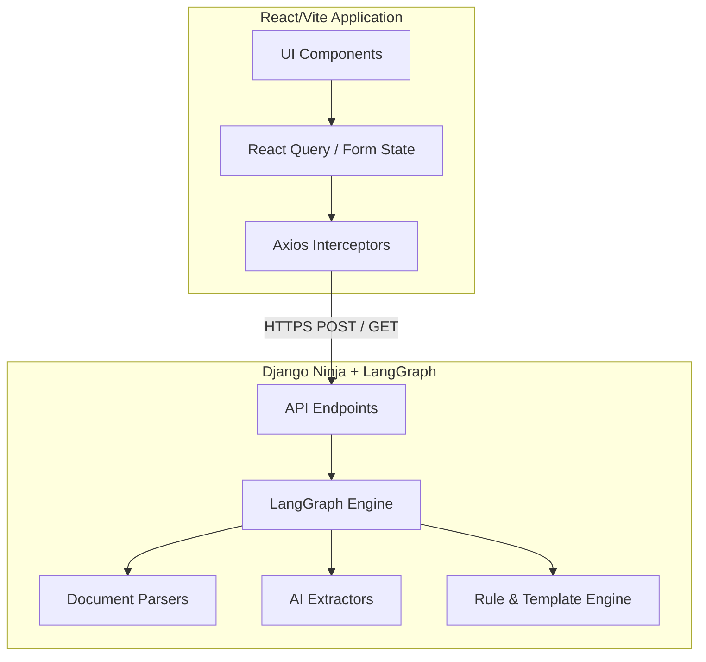
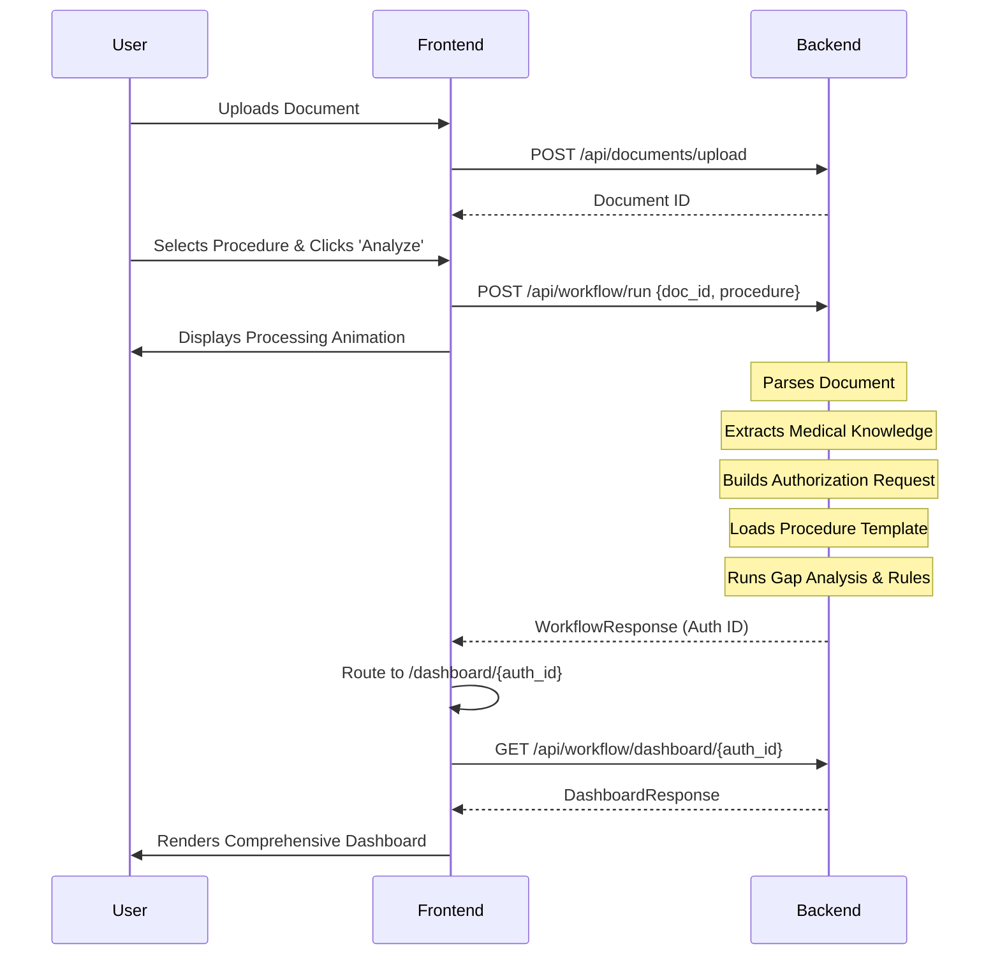

# Tvarit AI - Frontend Project Overview

## 1. Project Purpose & Mission
**Tvarit AI** is an intelligent Prior Authorization Pre-validation Platform. 
**Mission:** Our core objective is *not* to approve or deny insurance claims. Instead, our mission is to **reduce first-time prior authorization rejection** by ensuring every submission is complete and compliant *before* it ever reaches the payer. We operate as an advanced gap-analysis engine, catching critical missing evidence—like a missing X-Ray or conservative treatment history—that would otherwise trigger an automatic denial. By preemptively identifying these gaps, we save healthcare providers administrative rework and accelerate patient care.

## 2. High-Level Architecture Diagram
The architecture strictly separates the React frontend from the Django backend. All communication occurs over secure REST APIs.



## 3. End-to-End Request Lifecycle & Workflow
The platform orchestrates a highly deterministic user journey. The workflow strictly follows these phases:

1. **Ingestion (Upload):** The clinician or administrative staff uploads raw medical documents (e.g., Clinical Notes, Scanned PDFs).
2. **Configuration (Setup):** The user selects the intended procedure (e.g., MRI Lumbar Spine - Code 72148).
3. **Orchestration (Processing):** The system triggers the orchestration workflow. The backend runs the LangGraph engine. The frontend displays a dynamic loading state simulating parsing, extraction, and gap analysis.
4. **Analysis (Results):** The user is seamlessly routed to the Authorization Dashboard.
5. **Remediation (Action):** The dashboard renders the Readiness Score, Risk Level, and actionable Next Best Actions (e.g., "Upload Lumbar X-Ray").

### Sequence Diagram


## 4. Application Modules
The frontend application is divided into distinct, cohesive modules:
*   **Ingestion Module:** Dropzones, file validation, and upload progress.
*   **Workflow Module:** Procedure selection forms and orchestration loading states.
*   **Dashboard Module:** Data visualization (Readiness Gauges, Risk Badges), evidence rendering, and recommendation lists.
*   **Core/Shared Module:** Navigation, layout shells, theming, and API configuration.

## 5. Frontend Folder Overview
The architecture follows a standard feature-based React structure using pure JavaScript (JSX).

*   `src/components/ui/`: Reusable, generic UI primitives (shadcn/ui based).
*   `src/components/features/`: Domain-specific components grouped by module (e.g., Dashboard, Upload).
*   `src/pages/`: Main application views (DashboardPage, UploadPage).
*   `src/layouts/`: Layout shells containing navigation and sidebars.
*   `src/hooks/`: Custom React Query hooks (`.js`) containing server-state logic.
*   `src/services/`: API Axios instances and endpoint callers.
*   `src/contexts/`: React Contexts (e.g., ThemeProvider).
*   `src/utils/`: Utility functions, formatting logic.
*   `src/constants/`: Centralized JavaScript constants and configurations.

## 6. Data & Component Communication Flow
Data strictly flows downward.
*   **Server State:** Managed entirely by React Query (`useQuery`, `useMutation`). No Redux is used. Cached data is passed as props to smart container components, which delegate to dumb presentational components.
*   **Local State:** Managed via `useState` or `useReducer` for localized component interactions (e.g., expanding an accordion, typing in a combobox).
*   **Form State:** Managed by `react-hook-form` paired with `zod` for client-side validation before API submission.

## 7. Navigation Map
```mermaid
graph LR
    Root[/] --> Upload[Upload Document]
    Upload --> Config[Procedure Config]
    Config --> Process[Processing Orchestration]
    Process --> Dashboard[Results Dashboard]
    
    Root --> History[Past Submissions *Future*]
    History --> Dashboard
```

## 8. Why Each Page Exists
*   **Upload Page:** To securely ingest unstructured clinical documents. It is the entry point of the application.
*   **Processing Page:** To map the unstructured document to a specific insurance requirement template. The processing page provides critical user feedback (reducing perceived latency) while the heavy AI extraction runs on the backend.
*   **Dashboard Page:** The core product. It distills complex gap analysis into a clear, actionable summary. It exists so that administrative staff know *exactly* what is missing before clicking "Submit to Payer".
